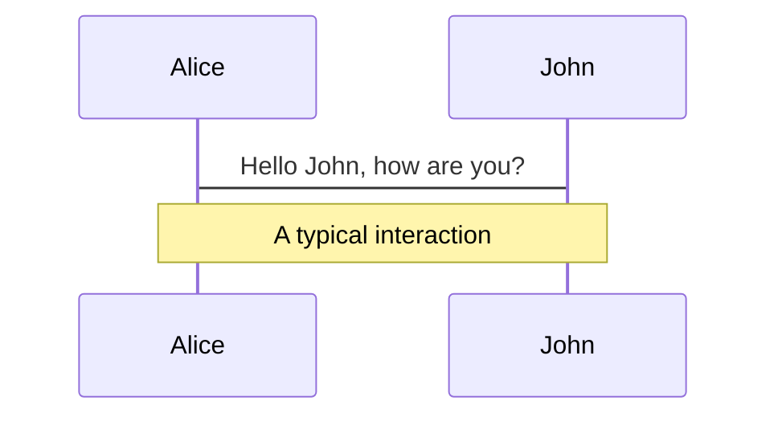
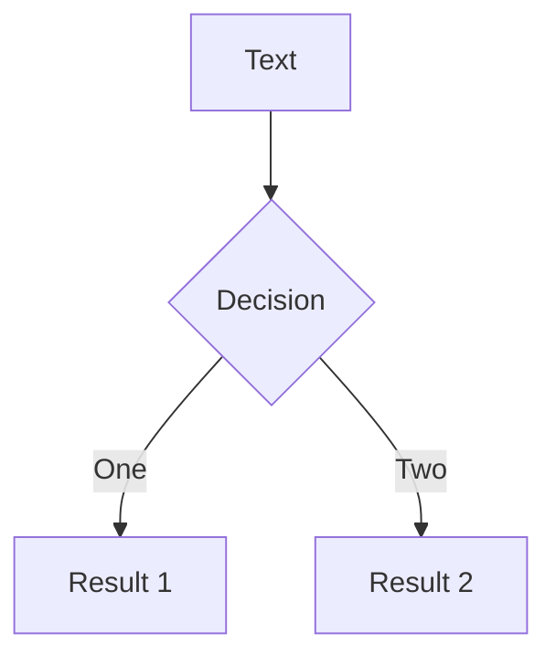
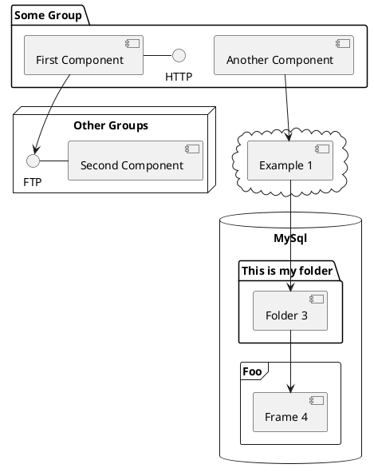

---
layout: default-7
src: slides/presentation-overview
---

---
layout: default-6
src: slides/the-old-way
---

---
layout: default-3
---

# Monolithic Front-end

`my-ocf-app`

<!-- ./components/SelfPromo.vue -->
<SelfPromo />

---

# Diagrams

You can create diagrams / graphs from textual descriptions, directly in your Markdown.

[Learn More](https://sli.dev/guide/syntax.html#diagrams)
